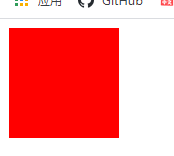

## CSS样式的权重计算

:::tip
### 前言
某一天小螺号在✍css样式的时候发现对同一个标签添加样式时id选择器和类选择器居然不会冲突！
而是显示了其中一个样式！这是为啥呢？:100:
:::

### CSS的权重比较
首先让我们看一下下面这段代码显示怎样的效果：
```html
<html>
<head>
  <style>
    div{
      width: 100px;
      height: 100px;
      background-color: black;
    }
    .box{
      background-color: blue;
    }
    #box{
      background-color: red;
    }
  </style>
</head>
<body>
  <div class="box" id="box"></div>
</body>
</html>
```
效果：

可以看出来它为红色，明明对同一个标签进行了三次设置背景颜色，最终却是红色。🤔
原来是因为css也有权重的问题。因为id选择器的权重>类选择器>元素选择器；所以最终显示id选择器的红色。

在css里样式的权重为：
<b> !important > 内嵌样式 > ID > 伪类 | 标签  | 属性 > 伪对象 > 继承 > 通配符</b>

还有一种计算权重的方法，但是科不科学有待考究：
important  1  0  0  0
id  0  1  0  0
class    0  0  1  0
tag(标签)  0  0  1  0
伪类     0  0  1  0
att属性    0  0  1  0
伪对象    0  0  0  1
通配符    0  0  0  0 

```css
.a div{// 10*1+1*1=11
}
.a #a{// 10*1+100*1=110
}
```

#### !important
!important可以看作正无穷大，!important的权重值虽然是正无穷，但其实也是可也计算的，比如正无穷+1或者*1，就是要比正无穷大，其原理是不管那种语言，在计算机中正无穷的值，都是一个有界的。不是数学上无界的一个慨念。

```css
div{
  width:100px !important; //要在分号前加!important
}
```

### 补充
#### 元素自身的权重是最低的

```html
<html>
<body>
  <div width="100"></div>
</body>
</html>
```

#### css样式是自上而下的（单线程）
```html
<html>
<head>
  <link rel="stylesheet" type="text/css" href="a.css" />
  <style>
    div{
      width: 100px;
      height: 100px;
      background-color: black;
    }
    .box{
      background-color: blue;
    }
    #box{
      background-color: red;
    }
  </style>
</head>
<body>
  <div class="box" id="box"></div>
</body>
</html>
```
如果a.css有对div修饰的样式那么会执行a.css里的配置。

实际中，最后到底加载的是那一条样式，是一个相对复杂的问题，就简单而言就与引入顺序有关。

总结的比较简陋，本意上是相当于记录笔记了，如有漏写、错误或不恰当之处欢迎指出批评，感谢！
