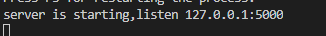
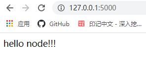
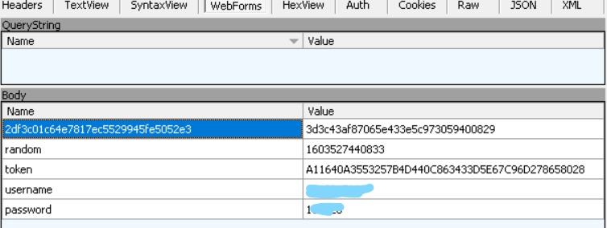
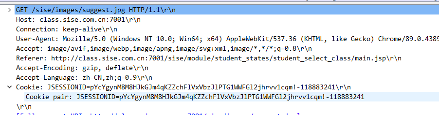

:::tip
### 前言
有一天，小螺号问我最近他的项目要有一个本校学生的学生认证功能，经过不懈努力想到了一个妙计！
通过爬取学生系统并提交学号密码来获取个人信息。
:100:
:::

### 准备工作
本机要有node.js。然后npm安装[express](https://www.expressjs.com.cn/)框架。
```
npm install express --save
```
然后在根目录创建models文件夹放模块功能。

因为直接运行 express 不能实时刷新，那么我可以通过 <font color="red">npm install -g supervisor</font> 使项目可以改变文件时会自动重新运行。

现在我们可以通过 <font color="red">supervisor app.js</font> 运行项目来看一下效果啦。



现在我们准备工作已经做完了，可以开始进行功能开发啦。
### 第一步（抓包）
要爬取校园网我们要知道它是提交什么数据。


通过图片我们知道它提交5个数据。

然后它还要一个cookie才能进行提交。


### 第二步（功能开发）
```js
var express = require('express');
var request = require('request');
var cheerio = require('cheerio');
var axios = require('axios');

var app = express();


app.get('/student', function (req, res) {
  var param = req.query || req.params;
  console.log('param:',param);
  var url = 'http://class.sise.com.cn:7001/sise/';
  var toLogin_url = 'http://class.sise.com.cn:7001/sise/login_check_login.jsp'
  var JSESSIONID = ''
  var random = ""
  var post_key = ''
  var post_value = ''
  var username = param['username']
  var password = param['password']

  function parseHtml(result) {
    console.log(result.data)
    var $ = cheerio.load(result.data);
    var i = $('div[align=center]').html()
    var ser = $(i).serializeArray();
    random = ser[1].value
    // console.log('random',random)
    post_key = ser[0].name
    // console.log('post_key',post_key)
    post_value = ser[0].value
    // console.log('post_value',post_value)

    var cookie = result.headers['set-cookie']
    var cookie1 = cookie[0].split(";")
    JSESSIONID = cookie1[0]

  }

  function get_values(a) {
    axios.request({
      method: "get",
      url: url
    }).then(res => {
      parseHtml(res);
      a()
    }).catch(err => {
      console.log(err)
    })
  }

  function to_login() {
    get_values(function () {
      var post_data = {};
      post_data = post_key;
      data = {
        [post_data]: post_value,
        'random': random,
        'token': '',
        'username': username,
        'password': password
      }
      request.post(
        {
          headers: {
            'Content-Type': 'application/x-www-form-urlencoded',
            'Cookie': JSESSIONID,
          },
          url: toLogin_url,
          form: data
        },
        function (error, _res, body) {
          if (!error && res.statusCode == 200) {
            const reg = /index.jsp/i; 
            if(reg.test(body)){
                res.json('success')
            }else{
                res.json('fail')
            }
          }
        })
    });
  }

  to_login();
})


module.exports = app;
```
cheerio该模块进行html解析来获取网页信息。

当访问 http://class.sise.com.cn:7001/sise/login_check_login.jsp 返回包含index.jsp的信息表示登录成功

这样我们就可以爬取个人信息，包括课程、成绩等。

由于还没开发就还没代码。等小螺号有时间就可以更新啦！！！

待续！！

